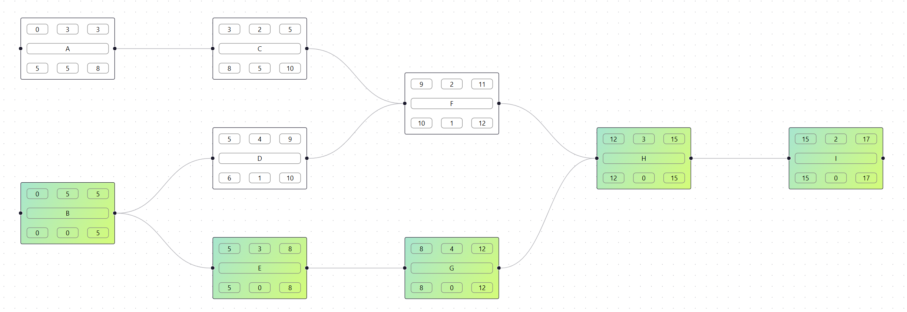

## Technologies

- **Frontend:**
  
- **Backend:**
  

## Features

1. **CPM Diagram Creation:**
   - Users can create and modify tasks and their dependencies.
   - Each task can have a name, duration, and other relevant information.

2. **Critical Path Calculation:**
   - After entering the task and dependency data, the application automatically calculates the critical path, highlighting the key tasks that determine the total project duration.

3. **Table View:**
    - Data can also be read in consise table form

4. **Gantt Chart:**
    - App will also create gantt chart based on calculations

## Installation

### Frontend

1. **Clone the repository:**
   ```bash
   git clone https://github.com/PatrysUwU/CriticalPathMethodVisualisation
   cd CriticalPathMethodVisualisation
   ```
2. **Install dependencies:**
    ```bash
    cd frontend
    npm install
    ```
3. **Start frontend:**
    ```bash
    npm run dev
    ```
4. **Start backend:**
    ```bash
    cd ../backend
    go mod tidy
    go run main.go
    ```
# Screenshots



